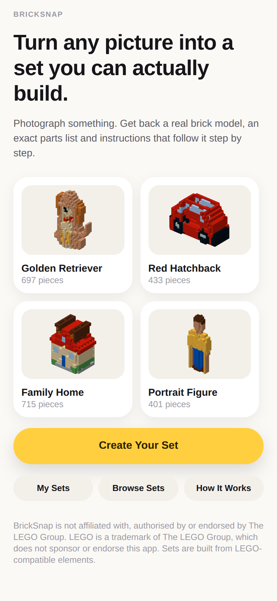
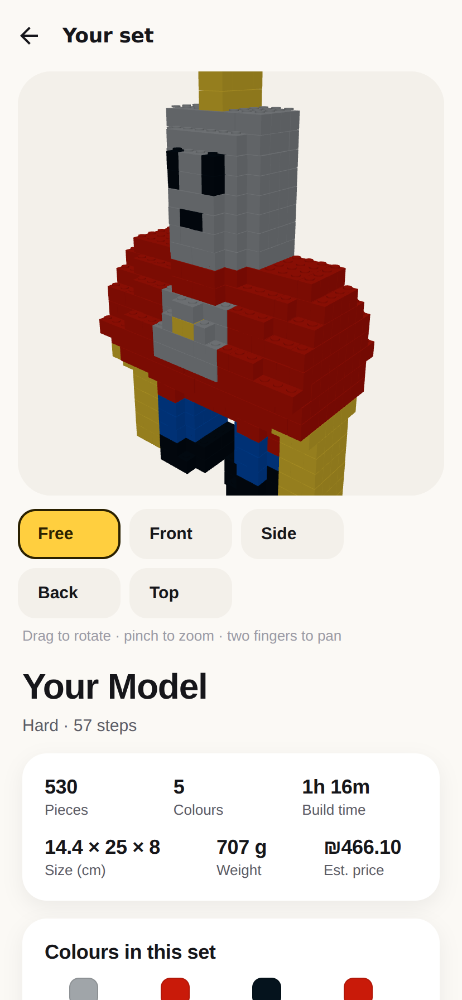
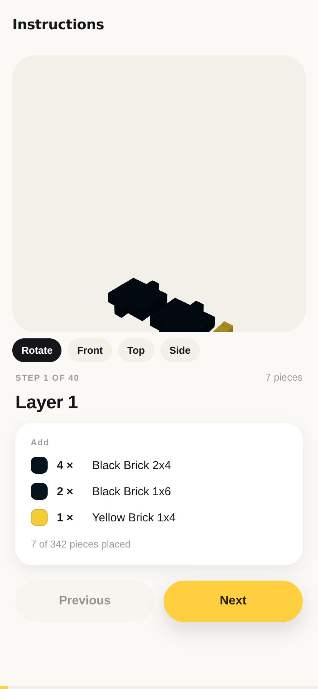
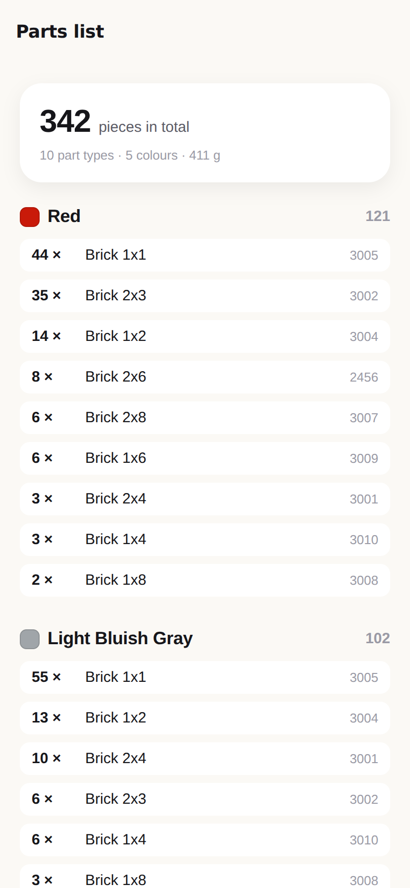

# BrickSnap

Turn a photo into a brick set you can actually build.

Upload a picture. The app works out what it is, reconstructs it in three
dimensions, fills that shape with real LEGO-compatible elements, proves the
result can be assembled, and hands back a 3D model, a parts list, step-by-step
instructions and a price — all describing the same object.

> BrickSnap is not affiliated with, authorised by or endorsed by The LEGO
> Group. Sets are built from LEGO-compatible elements. The exact wording is
> configurable in `server/app/config.py` and is served to the app, so it can
> be changed in one place.

## Running it

Two processes: a Python API and an Expo app.

```bash
# API
cd server
pip install -r requirements.txt
uvicorn app.main:app --reload --port 8000

# app, in another terminal
cd app
npm install
npx expo start
```

`npx expo start` prints a QR code: scan it with Expo Go to run the app on a
phone. `npx expo start --web` runs the same app in a browser, which is how the
screenshots below were taken.

The app reads the API's address from `extra.apiUrl` in `app/app.json`. If that
is a loopback address and the app is running on a phone, it looks for the API
on the machine that served the bundle instead, at the same port — so Expo Go
works without editing anything. Point `extra.apiUrl` at a real host to
override that.

A set belongs to the install that made it. The app generates an id once, keeps
it, and sends it with every request; the server stores it on the model and
lists only that install's sets. It is not an account — there is nothing to
sign into — but it is the thing an account would later attach to. A set still
opens by its id for anyone given the link.

Ordering from the app uses the same checkout as the website: the design is
approved by fingerprint, the server creates the payment session, and the app
opens the provider's page. No card detail passes through the app. With no
`STRIPE_SECRET_KEY` set, payment runs in test mode and the order page offers a
button that marks it paid without charging anything.

## What it looks like

`docs/screens/` holds a shot of every screen, captured by driving the real app
against the real API — no mockups. The model in them is built from a single
photo of a toy robot.

| | |
|---|---|
|  |  |
|  |  |

Subject recognition uses Claude vision when `ANTHROPIC_API_KEY` is set in the
API's environment. **The key is read server side and never sent to the app.**
Without it everything still works: the analysis falls back to computer vision,
and you get a correct model with a generic name and a conservative depth.

```bash
export ANTHROPIC_API_KEY=sk-...        # optional
export BRICKSNAP_DATA=./data           # where models and orders are kept
export BRICKSNAP_SUPPLIER=compatible   # which supplier to quote against
```

## The website (web store)

`web/` is the customer-facing store built on the same engine: upload photos,
pick a subject and size, watch the real build stages, turn the 3D model,
read the parts list and instructions, approve, pay and track the order. The
exact model the customer approves (by fingerprint) is what is charged, what
the supplier purchase order lists and what the booklet shows.

```bash
# development: API on :8000, site on :5173 (proxies /api to the API)
cd server && uvicorn app.main:app --reload --port 8000
cd web && npm install && npm run dev

# one process: build the site, then the API serves it on :8000
cd web && npx vite build && cd ../server && uvicorn app.main:app --port 8000

# or as one image
docker build -t bricksnap . && docker run -p 8000:8000 -v bricksnap-data:/data bricksnap
```

The operations screen is at `/ops` (orders, supplier purchase orders, CSV
and BrickLink XML downloads, status changes and refunds).

| Variable | Default | What it does |
|---|---|---|
| `BRICKSNAP_PUBLIC_URL` | request host | Base URL for payment redirects and booklet links |
| `BRICKSNAP_ADMIN_TOKEN` | unset (ops locked) | Token for `/ops` and `/api/admin/*` |
| `STRIPE_SECRET_KEY` | unset: test payments | Stripe Checkout; without it a test "pay" page is used and nothing is charged |
| `STRIPE_WEBHOOK_SECRET` | unset | Verifies `/api/store/webhooks/stripe` |
| `BRICKSNAP_SHIP_COUNTRIES` | `IL` | Comma-separated ISO codes checkout accepts |
| `BRICKSNAP_SUPPLIER` | `compatible` | Which supplier quotes and receives orders |
| `BRICKSNAP_PRICELIST_WOBRICK` / `_BRICKWITH` / `_MARSTOY` | unset | CSV price list (`design_id,color_id,supplier_sku,unit_cost[,stock]`) that turns that supplier on |
| `BRICKSNAP_FX_USD_ILS` | `3.7` | Exchange rate for USD price lists |
| `BRICKLINK_CONSUMER_KEY` etc. | unset | BrickLink price reference only (it cannot place orders) |
| `BRICKSNAP_MAX_BUILDS` / `BRICKSNAP_BUILDS_PER_HOUR` | `2` / `20` | Concurrent builds, and builds per visitor per hour |

Prices are in ILS with VAT. No supplier has an ordering API (see
`docs/SUPPLIER_RESEARCH.md`), so a paid order writes a purchase order that a
person sends by email or portal; the ops screen then moves it along and the
customer's order page follows.

For a live deployment: set `BRICKSNAP_PUBLIC_URL`, `BRICKSNAP_ADMIN_TOKEN`
and the Stripe keys, point the Stripe webhook at
`/api/store/webhooks/stripe`, keep `/data` on a persistent volume, and put
it behind HTTPS.

## How a photo becomes a set

Each stage is a separate module. None of them is a prompt: the vision model
names the subject and judges its depth, and everything after that is geometry
and arithmetic, which is what makes the result repeatable and the parts list
something you can actually put in a box.

| Stage | Module | What it does |
|---|---|---|
| Reference analysis | `pipeline/reference_analyzer.py` | Segments the subject, measures it, names it, and decides what to ask the user |
| Geometry | `pipeline/geometry.py` | Silhouettes → a filled volume on the stud grid |
| Optimisation | `pipeline/optimizer.py` | Hollows it, calms the colours, props overhangs |
| Brick conversion | `pipeline/brick_generator.py` | Volume → real elements, real colours, staggered seams |
| Validation | `pipeline/validator.py` | Proves it can be built; repairs it until it can |
| Instructions | `pipeline/instructions.py` | A booklet whose every step rests on the last |
| Parts | `pipeline/inventory.py` | The bill of materials, counted from the model |
| Pricing | `pipeline/pricing.py` | A price traced to that bill |
| Editing | `pipeline/editor.py` | Plain-language changes to a set that already exists |
| Orders | `pipeline/orders.py` | The kit, through whichever supplier is configured |

Two libraries sit underneath: `library/bricks.py` is the only source of
parts, and `library/colors.py` the only source of colours. Nothing may invent
either. `library/suppliers.py` is the abstraction that keeps fulfilment from
being wired into the app.

### The geometry, specifically

A photo shows one side of a thing, so the third dimension has to come from
somewhere:

- **Two or more photos** give it honestly. A cell is solid only where it is
  inside the subject in every view that can see it — a visual hull, the same
  carving a turntable scanner does with two silhouettes instead of two hundred.
- **One photo** cannot, so the app asks before interpreting. The silhouette is
  extruded with a depth profile: how far a point stands proud depends on how
  far it is from the outline, which is what makes a face read as a face rather
  than a cardboard cut-out.

Coordinates: `x` and `z` are studs (8 mm); `y` is counted in plate units
(3.2 mm) so plates and bricks share one grid. A standard brick is three.

### What "buildable" means here

The validator is the gate — nothing reaches a screen until it passes:

1. Every element is one the library stocks.
2. No two share a cell; nothing sits below the baseplate.
3. Everything is clutched to something — studs, not mere adjacency.
4. Everything can be reached building *upward* from the baseplate. A piece
   whose only joint is to something above it is connected once finished but
   could never have been placed, so it counts as unsupported and gets propped.
5. The centre of mass falls over the footprint.
6. Every step can be assembled onto the one before it.

Failures are repaired and re-checked rather than reported, and repairs are
shown to the user.

### One model, three views of it

The digital model, the parts list, the instructions and the physical kit must
be the same object. That is enforced, not hoped for: the structure is hashed
into a fingerprint that the model, parts and steps endpoints all carry, the
instructions screen refuses to open if the two it fetched disagree, and the
order route refuses a set whose list and model do not reconcile.

## Changing a set you already have

"Make it bigger." "Use fewer pieces." "Make the roof red." "Make it stronger."

An edit never generates a fresh model. There are two paths, and which one runs
depends on what changed:

- **Recolour** edits the structured model in place. Nothing moves, so the
  structure is untouched — and it is re-validated anyway, because "cannot
  fail" is a claim better checked than trusted.
- **Rebuild** (size, detail, strength) runs the pipeline again over the same
  reference photos with different answers. A bigger model is not a scaled
  copy of a smaller one; it is a different tiling of a finer grid, so there is
  nothing to scale.

Either way the set keeps its identity, gains a version in its history, and
the parts list, booklet, preview and price are regenerated from the result.

Instructions are parsed by Claude when a key is configured and by keyword
otherwise. The fallback handles combined requests ("make the base dark blue
and the top yellow" colours two different regions) and reports what it
understood before anything is applied, so a misread is visible rather than
sat through. A request it cannot express — "give it a hat" — is refused with
a suggestion rather than approximated.

## Size presets

| Preset | Piece budget | Max dimension | Colours |
|---|---|---|---|
| Mini | 180 | 12 cm | 6 |
| Small | 400 | 16 cm | 8 |
| Medium | 900 | 22 cm | 12 |
| Large | 1800 | 30 cm | 16 |
| Display | 4500 | 42 cm | 20 |

The budget is *measured*, not predicted: the builder lays the bricks, counts
them including any support the validator adds, and shrinks the model until it
fits. "Small" therefore means small.

## Testing

```bash
cd server && python -m pytest tests/ -q     # 64 tests
cd app && npx tsc --noEmit                  # typecheck
```

The suite is weighted toward the promise rather than the plumbing: that models
validate, that no two bricks overlap, that the parts list reconciles exactly,
that every step rests on the last, that presets respect their budgets, that
prices add up, that an edit keeps the parts list matching and cannot ask for a
colour nobody stocks, and that bad input — a text file, a blank frame, a blurry
photo, two objects, a subject too small to resolve — fails in a way a person
can act on.

## What is built, and what is not

Phases 1 and 2 of the brief are complete and working end to end: upload,
analysis, questions, a structured brick model, 3D preview, physical validation,
instructions and the parts list.

Phase 3 is partly done: editing and version history work (see above), and
multiple reference photos are supported end to end. What is left:

- **No accounts.** Models are stored per install, in `Store`, which is the
  only class that touches the disk — swapping it for Postgres is one class.

Phase 4 has its seams in place but is not finished:

- **Payment** is connected on the website (Stripe Checkout, or test
  payments when no key is set). The Expo app does not take payment.
- **Fulfilment is not contracted.** The website's orders go to the built-in
  compatible-brick route as purchase orders. Wobrick, Brickwith and Marstoy
  are wired in as price-list suppliers and switch on when their price list
  is loaded; no supplier has been contacted.

## Known limitations

- **Single studs are still the largest share of the piece mix** — 58% on a
  simple build, 71% on a detailed one. A photo reduced to a stud grid leaves
  short colour runs along every boundary, and a short run is bought as 1x1s.

  Most of the way there was one mistake, worth recording because it looked
  like an optimisation. Cells hidden inside the model were being painted a
  single cheap grey, on the reasoning that an invisible brick may as well be
  the cheapest one. But the colour of a photographic subject happens to be
  constant along the depth axis, so a full-depth column was a single colour
  and tiled into one long brick — until the grey split it into skin, grey
  core, skin. Removing that pass cut a test model from 2,169 pieces to about
  1,620 and its price by 17%.

  Hollowing turned out to be near-neutral for the same underlying reason:
  every cell removed from under the skin leaves a brick with nothing to rest
  on, and the support pass puts most of them back. It is a weight dial, not a
  cost one.

  What remains is genuine colour variation in the photograph, which the detail
  setting already exposes to the user as a trade against fidelity.
- **Depth from a single photo is an interpretation**, and the app says so
  rather than implying a scan.
- **`query-string` is pinned directly** in `app/package.json`. `expo-router`
  4.0.22 imports it without declaring it, so the bundle will not build without.
